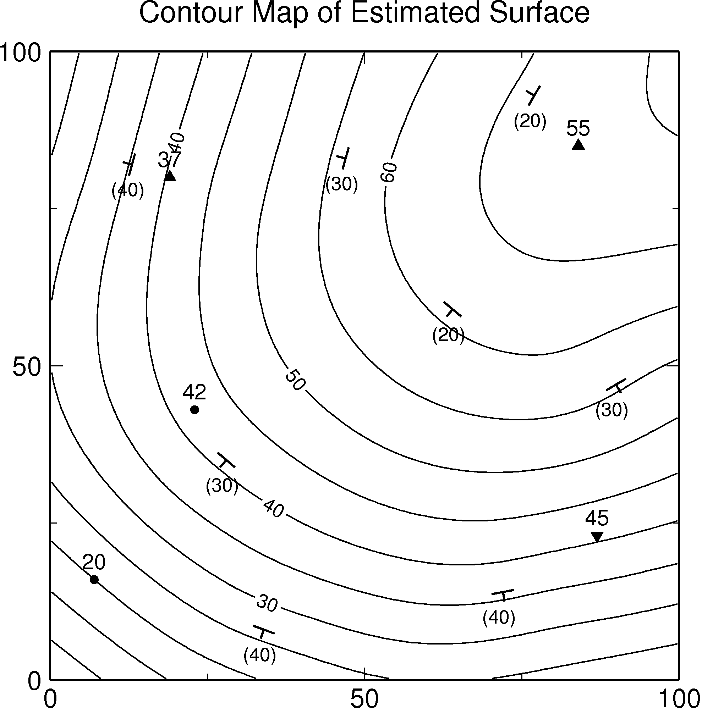

# BS-Horizon Repository

## Description
BS-Horizon is a Fortran77 program for determination of an optimal geologic surface using both elevation data and strike-dip data.
  
## Input data format
Elevation data and strike-dip data are available. File format of each data are as follows.

### 1. Elevation data
#### Format =>  id, x, y, z, lm  
lm=0 gives equality constraint that the surface passes through the point. lm=-1 and lm=1 give inequality constraintthat the surface passes under the point or above the point respectively. "0, 9e9, 9e9, 9e9, 9" is required in final line.
Example ( elevation.xyz ):
```
1,7,16,20,0
2,19,80,37,1
3,23,43,42,0
4,87,23,45,-1
5,84,85,55,1
0,9e9,9e9,9e9,9
```

### 2. Strike-dip data
#### Format =>  id, x, y, z, trend, dip  
Strike-dip information is given as *trend* and *dip*. The *trend* is an azimuth direction of maximum slope of the surface measured clockwise from north. The *dip* is a slope angle of the surface. "0, 9e9, 9e9, 9e9, 9e9, 9e9" is required in final line. 
Example ( dip.xyz ):
```
1,13,82,32,285,40
2,28,35,45,220,30
3,34,8,35,200,40
4,47,83,48,285,30
5,77,93,50,300,20
6,64,59,65,220,20
7,72,14,39,170,40
8,90,47,45,150,30
0,9e9,9e9,9e9,9e9,9e9
```
  
## Usage
### 1. How to complie BS-Horizon
Compile with GFortran compiler.

```
gfortran bs_horizon.f -o bs_horizon.out
```
### 2. How to run BS-Horizon
Following is an example of surface estimation ( DEM generation ) using equality/inequality elevation data and strike-dip data. As for each parameters, please see Nonogaki *et al.* (2008).

**Step 1.** Run "bs_horizon.out".
```
./bs_horizon.out
```

**Step 2.** Set file names of elevaiton data and strike-dip data (optional).
```
#####Data input#####  
File name for elevation data   = elevation.xyz  
Do you have trend & dip data ?  
                : 1(yes),0(no) = 1  
File name for trend & dip data = dip.xyz  
```

Basic information of input data is displayed.
```
#####Data information#####  
Number      : NH(Height data)      =       5  
            : ND(Trend & dip data) =       8  
Data area   : x(min),x(max)        =      7.0000     90.0000  
            : y(min),y(max)        =      8.0000     93.0000  
            : z(min),z(max)        =     20.0000     55.0000  
```

**Step 3.** Set calculation range and the number of division which gives the number of knots used for B-spline definition.
```
#####Calculation region#####  
Calculation region : x(min),x(max) = 0,100  
                   : y(min),y(max) = 0,100  
Number of division   Mx,My must be =<200  
                   : Mx,My         = 50,50  
```

**Step 4.** Set calculation penalty alpha, penalty gamma, m1 and m2 parameters. To use inequality elevation data, alpha(min/max) and the number of iteration are also required.
```
#####Calculation parameter#####  
Some iteration is required.  
Q= J+alpha*R       : alpha(min)    = 1  
                   : alpha(max)    = 100  
            number of iteration    = 10  
R=Rh+gamma*Rd      : gamma         = 10000  
J=m1*[(fx)**2+(fy)**2]+  
  m2*[(fxx)**2+2(fxy)**2+(fyy)**2]  
                   : m1,m2         = 0,1
```

Calculation results (the values of functionals) in each step are displayed.
```
#####Number of constraints#####  
elevation constraints : NH         =      5  
    slope constraints : ND         =      8  
#####Estimation result#####  
iteration=   1  alpha= 0.10000E+01  gamma= 0.10000E+05  
------------------------------------------------------  
H : data =     2  Rh = 0.10501E+00  Error= 0.32405E+00  
D : data =     8  Rd = 0.34521E-06  Error= 0.58755E-03  
------------------------------------------------------  
Jx = 0.43547E+00  Jy = 0.71844E+00  
Jxx= 0.10977E+01  Jxy= 0.23049E+00  Jyy= 0.14591E+01  
J1 = 0.11539E+01  J2 = 0.30177E+01  
------------------------------------------------------  
Q  = 0.31262E+01  J  = 0.30177E+01  aR = 0.10846E+00  

#####Number of constraints#####  
elevation constraints : NH         =      5  
    slope constraints : ND         =      8  
#####Estimation result#####  
iteration=   2  alpha= 0.16681E+01  gamma= 0.10000E+05  
------------------------------------------------------  
H : data =     2  Rh = 0.48707E-02  Error= 0.69790E-01  
D : data =     8  Rd = 0.79084E-07  Error= 0.28122E-03  
------------------------------------------------------  
Jx = 0.57872E+00  Jy = 0.82724E+00  
Jxx= 0.82259E+00  Jxy= 0.19538E+00  Jyy= 0.11207E+01  
J1 = 0.14060E+01  J2 = 0.23341E+01  
------------------------------------------------------  
Q  = 0.23435E+01  J  = 0.23341E+01  aR = 0.94440E-02  

---  

#####Number of constraints#####  
elevation constraints : NH         =      5  
    slope constraints : ND         =      8  
#####Estimation result#####  
iteration=  10  alpha= 0.10000E+03  gamma= 0.10000E+05  
------------------------------------------------------  
H : data =     2  Rh = 0.14621E-05  Error= 0.12092E-02  
D : data =     8  Rd = 0.22088E-10  Error= 0.46998E-05  
------------------------------------------------------  
Jx = 0.58121E+00  Jy = 0.83053E+00  
Jxx= 0.82845E+00  Jxy= 0.19492E+00  Jyy= 0.11249E+01  
J1 = 0.14117E+01  J2 = 0.23432E+01  
------------------------------------------------------  
Q  = 0.23434E+01  J  = 0.23432E+01  aR = 0.16830E-03  
```

**Step 5.** Input file name of DEM, output range, the number of grids. Optimal surface file can be saved (optional). 
```
#####Output result to files#####  
File name for DEM or no (skip)     = result.grd  
Output region      : x(min),x(max) = 0,100  
                   : y(min),y(max) = 0,100  
Number of grid       Nx,Ny must be =< 1001  
                   : Nx,Ny         = 201,201  
File name for optimal surface  
                      or no (skip) = result.opt  
```

**Step 6.** Select next work ( To finish, type zero ).
```
#####Next work#####  
Change input data            = 1  
Change calculation region    = 2  
Change calculation parameter = 3  
Output result to files       = 4  
End                          = others  
                   next work = 0  
```

**Result**  
  


## Reference
Nonogaki S, Masumoto S and Shiono K (2008) Optimal Determination of Geologic Boundary Surface Using Cubic B-Spline. *Geoinformatics*, vol.19, no.2, pp.61-77 (in Japanese with English abstract). DOI: <https://doi.org/10.6010/geoinformatics.19.61>

